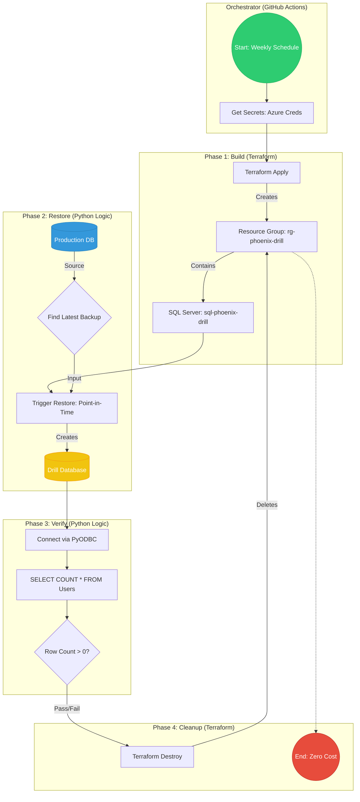

# 🔥 The Phoenix Protocol
### *Because a backup you've never tested isn't a backup — it's a liability.*

> An automated, zero-cost, serverless pipeline that **rises from the ashes every week** to prove your database can be restored — then vanishes without a trace.

---

## 📖 Table of Contents

- [The Problem](#-the-problem)
- [The Solution](#-the-solution)
- [Architecture](#-architecture)
  - [Ephemeral Infrastructure Pattern](#ephemeral-infrastructure-pattern)
  - [Workflow Diagram](#workflow-diagram)
- [Technology Stack](#-technology-stack)
- [Repository Structure](#-repository-structure)
- [Setup & Configuration](#-setup--configuration)
  - [Prerequisites](#prerequisites)
  - [GitHub Secrets](#github-secrets)
  - [Running the Drill](#running-the-drill)
- [The Four Phases Explained](#-the-four-phases-explained)
- [Success Metrics](#-success-metrics)
- [Future Roadmap](#-future-roadmap)

---

## 🚨 The Problem

Organizations trust their backups, but almost never **test** them. This creates a phenomenon known as **Silent Data Corruption** — a false sense of security where backups exist on paper but are unverifiable in practice.

Manual verification is:
- 💸 **Expensive** — it requires dedicated engineers and infrastructure.
- 🐢 **Slow** — setting up a test environment takes hours.
- ❌ **Error-prone** — human steps lead to inconsistent results.

The consequence? When disaster strikes and a restore is actually needed, you discover the backup was broken all along.

---

## ✅ The Solution

**The Phoenix Protocol** is a fully automated **Disaster Recovery (DR) drill pipeline** that runs on a weekly schedule. It:

1. 🏗️ **Spins up** a temporary, isolated Azure environment from scratch using Terraform.
2. 🗄️ **Restores** your production database to that environment using Azure's point-in-time restore API.
3. 🔬 **Verifies** the restored data is alive and correct by running a live SQL query.
4. 💣 **Destroys** every resource it created — with zero idle costs remaining.

All of this happens automatically. **Zero human touch required.**

---

## 🏛️ Architecture

### Ephemeral Infrastructure Pattern

The Phoenix Protocol is built on the **Ephemeral Infrastructure** pattern — infrastructure that is created for a single, time-boxed purpose and then completely destroyed.

```
[GitHub Actions Scheduler]
        |
        v
[Terraform Apply] ──────> [Azure: Resource Group + SQL Server]  (Created fresh each run)
        |
        v
[Python: drill_master.py] ──> [Restore Prod DB] ──> [Verify Data]
        |
        v
[Terraform Destroy] ─────> [Azure: Everything Deleted]  (Zero trace remaining)
```

**Why Ephemeral?**
- 🔒 **Security** — the drill environment is fully isolated from production.
- 💰 **Cost** — resources exist for `< 20 minutes`, keeping the cost per run under **$0.05 USD**.
- 🧼 **Hygiene** — no zombie resources, no configuration drift, no surprises.

The `terraform destroy` step runs under `if: always()` in GitHub Actions — **even if the verification step crashes**, the cleanup is guaranteed.

---

### Workflow Diagram

The complete end-to-end flow of a single "Game Day" drill:



---

## 🛠️ Technology Stack

| Layer | Technology | Purpose |
|---|---|---|
| **Cloud Provider** | Microsoft Azure | Hosts all drill resources (East US region) |
| **Database** | Azure SQL Database (Basic, 5 DTU) | Target for restore and verification |
| **Identity** | Azure AD Service Principal | Secure, keyless CI/CD authentication |
| **IaC** | Terraform (`hashicorp/azurerm` v3.0+) | Provision and destroy drill infrastructure |
| **Automation** | Python 3.10+ | Orchestrate restore and verification logic |
| **Azure SDK** | `azure-identity` | Authenticate Python to Azure |
| **Azure SDK** | `azure-mgmt-sql` | Trigger point-in-time database restores |
| **Azure SDK** | `azure-mgmt-resource` | Resource group lookups |
| **DB Driver** | `pyodbc` + `msodbcsql18` | Execute live SQL queries against drill DB |
| **CI/CD** | GitHub Actions (`ubuntu-latest`) | Weekly scheduling and orchestration |
| **Secrets** | GitHub Repository Secrets | Store credentials — never hardcoded |

---

## 📁 Repository Structure

```
Phoenix-Protocol/
│
├── .github/
│   └── workflows/
│       └── phoenix_drill.yml       # Main CI/CD pipeline definition
│
├── infrastructure/                 # All Terraform IaC lives here
│   ├── providers.tf                # Azure provider & authentication config
│   ├── main.tf                     # Resource Group, SQL Server, Firewall Rule
│   ├── variables.tf                # Input variables (subscription_id, etc.)
│   └── outputs.tf                  # Exports sql_server_fqdn, resource_group_name
│
├── scripts/
│   └── drill_master.py             # Core Python logic (Identify → Restore → Verify)
│
├── requirements.txt                # Python dependencies
├── PRD.md                          # Product Requirements Document
├── TechStack.md                    # Technology choices and rationale
├── Design.md                       # System design & architecture notes
├── TODO.md                         # Phased implementation task list
└── README.md                       # This file
```

---

## ⚙️ Setup & Configuration

### Prerequisites

Before running the Phoenix Protocol, ensure the following are in place:

- [ ] An **Azure Subscription** with an active SQL Database (your "Production" source).
- [ ] An **Azure AD Service Principal** created via `az ad sp create-for-rbac`, with `Contributor` role on the subscription.
- [ ] **Terraform** installed locally (or available on the runner) — `v1.0+`.
- [ ] **Python 3.10+** installed.
- [ ] **ODBC Driver 18 for SQL Server** (`msodbcsql18`) installed on the runner OS.

### GitHub Secrets

Navigate to your repository → **Settings → Secrets and variables → Actions** and add the following secrets:

| Secret Name | Description |
|---|---|
| `AZURE_CLIENT_ID` | Service Principal Application (Client) ID |
| `AZURE_CLIENT_SECRET` | Service Principal Client Secret |
| `AZURE_TENANT_ID` | Your Azure Active Directory Tenant ID |
| `SUBSCRIPTION_ID` | Your Azure Subscription ID |
| `SQL_ADMIN_PASSWORD` | Password for the drill SQL Server admin account |

> ⚠️ **Security Rule:** No credentials are ever hardcoded. All secrets flow exclusively through GitHub's encrypted Secrets store.

### Running the Drill

**Automatic:** The pipeline triggers every Sunday at 2:00 AM UTC via a `cron` schedule in the workflow YAML.

**Manual:** Navigate to **Actions → Phoenix Drill Workflow → Run workflow** to trigger an on-demand drill at any time.

**Install Python dependencies locally:**
```bash
pip install -r requirements.txt
```

---

## 🔁 The Four Phases Explained

### Phase 1 — Build 🏗️
`terraform apply` creates two Azure resources inside an isolated resource group:
- **Resource Group:** `rg-phoenix-drill-{run_id}` — acts as a blast radius boundary.
- **SQL Server (Logical):** `sql-phoenix-{run_id}` — the target server for the restore.
- **Firewall Rule:** `AllowAzureServices` — permits the runner and Azure management plane connectivity.

Terraform **outputs** the `sql_server_fqdn` and `resource_group_name` for use by the Python script.

### Phase 2 — Restore 🗄️
`drill_master.py` uses `azure-mgmt-sql` to:
1. Locate the **source Production database** within its resource group.
2. Identify its **latest valid restore point** (`earliestRestoreDate`).
3. Issue a `CreateMode=Restore` API call — letting Azure create the drill database *during* the restore operation (no empty DB is pre-created).

### Phase 3 — Verify 🔬
Once the restore completes, the script:
1. Connects to the new drill database via `pyodbc` using ODBC Driver 18.
2. Executes: `SELECT COUNT(*) FROM dbo.Users;`
3. **Asserts** the row count meets the expected threshold (`>= 1` by default).
4. Logs **PASS** ✅ or **FAIL** ❌ to the GitHub Actions console.

### Phase 4 — Cleanup 💣
`terraform destroy -auto-approve` tears down the entire `rg-phoenix-drill-{run_id}` resource group and every resource within it.

- Runs with `if: always()` — **this step cannot be skipped**, even on upstream failure.
- After completion: **$0.00 in idle costs**. The phoenix burns.

---

## 📊 Success Metrics

| Metric | Target |
|---|---|
| **Mean Time to Verify (MTTV)** | `< 20 Minutes` per drill |
| **Cost Per Run** | `< $0.05 USD` |
| **Cleanup Success Rate** | `100%` — no zombie resources ever |
| **Human Intervention Required** | `0` — fully autonomous |

---

## 🚀 Future Roadmap

- [ ] **Alerting Integration** — Send Pass/Fail results to Slack or Email via webhooks.
- [ ] **Multi-Table Verification** — Extend assertions beyond a single Users table count.
- [ ] **Remote Terraform State** — Migrate state to Azure Blob Storage for team environments.
- [ ] **OIDC Authentication** — Replace client secrets with federated identity credentials for keyless auth.
- [ ] **Drill History Dashboard** — Log results to a lightweight store for trend tracking over time.

---

<div align="center">

**Built as a proof that resilience should be automated, not assumed.**

*The Phoenix always rises. Now, so does your confidence in your backups.*

</div>
